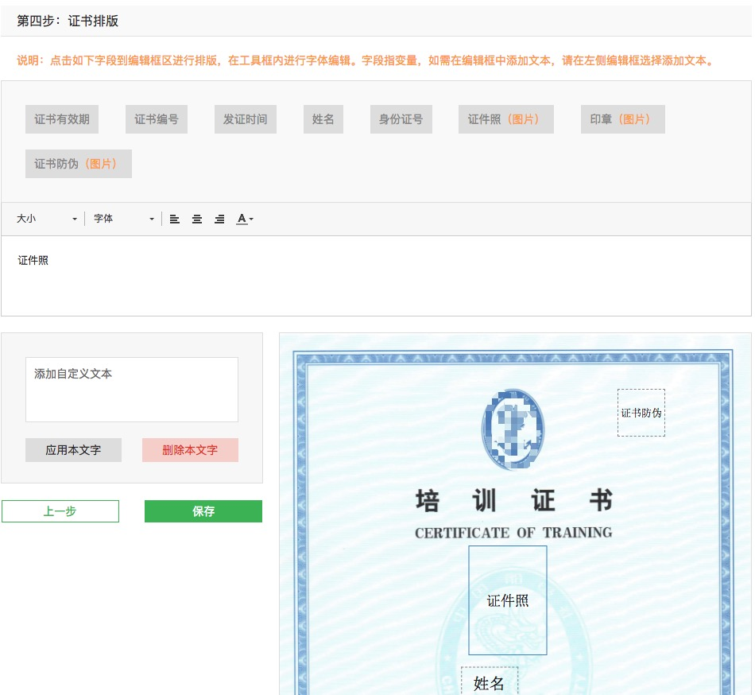
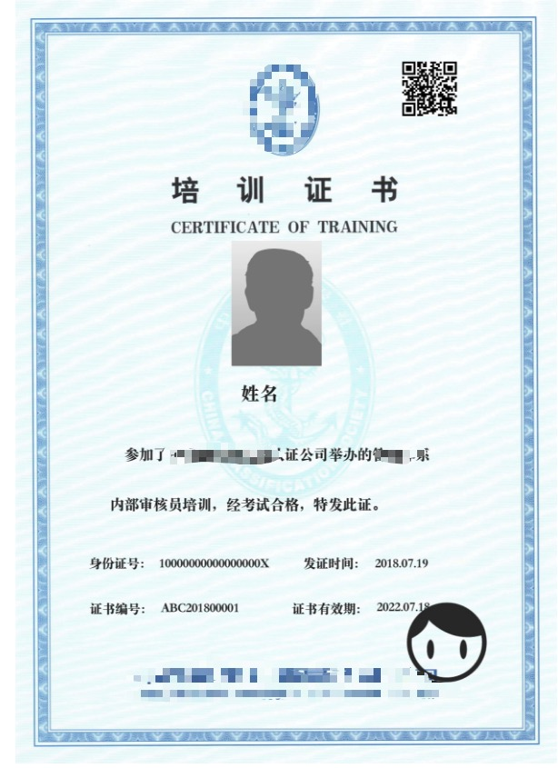

#### 项目背景

> 由于客户需要的证书模板不固定，数量较大，使用传统的方式（往证书背景图上贴数据）不满足需求，所以才开发了这款用户可以自定义的证书模板。

##### 步骤1：将上面所有的字段点到画板上并编辑好

#### 功能介绍

> 证书上的字段分动态字段和静态字段两种，动态字段包括（姓名，身份证，证件照等），静态字段包括正文内容等，用户可以自己选择输入。所有字段用户均可以通过上方的CKEditor编辑器来排版，调整颜色字体大小位置居中等操作。字段亦可以在画布内拖动，缩放等。点击保存后，可以再其他页面预览，再次打开可以恢复上一次编辑的状态。

##### 步骤2：确认好排版点击保存

#### 前端工作

> 前端部分是根据后台传过来的数据（字段信息等）将其遍历在最上排的字段列表里，然后做了一套自定义模板的功能，从点击字段，生成到画板上开始。用户可以自己随意拖动缩放字段，改变文字的大小颜色字体等样式。待所有字段都在画板上之后，点击保存可以将按照约定好的数据格式的数据返回给后端。然后后端根据接受到的数据做预览和下载等功能。

##### 步骤3：预览无误保存图片

**注：以上图片字段均为本人测试使用，并非真实字段和使用场景^_^**

-------

重构心得